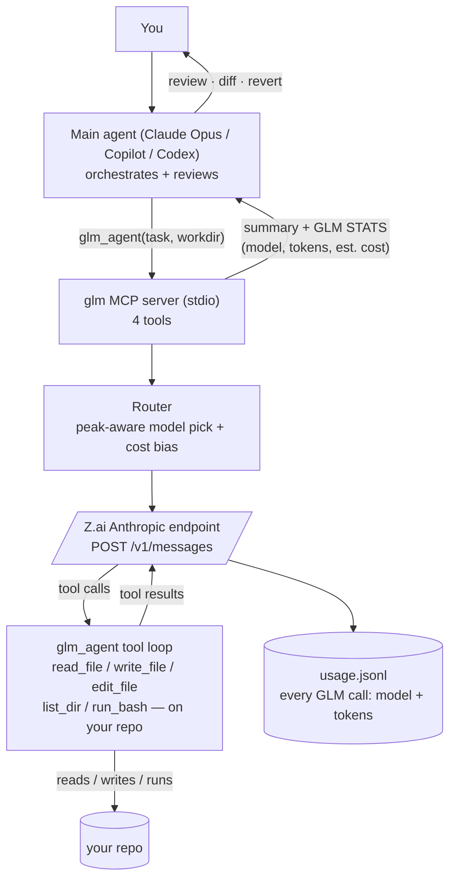

# glm-mcp — GLM as a cheap delegate for your AI coding agent

**GLM** (Zhipu / Z.ai) as a **~10x cheaper** delegate for your AI coding agent. Your expensive
main model — **Claude Opus**, **Copilot's** default, or **Codex** — orchestrates and reviews; **GLM** does
the actual work, billed on cheap GLM tokens. GLM exposes an Anthropic-compatible `/v1/messages`
endpoint, so it drops into anything that already speaks Anthropic. This repo wraps it as an
**MCP server** with four tools, plus one-command installers for **Claude Code**, **GitHub Copilot**,
and **Codex**. The same server powers every edition.

<p align="center">
  <a href="claude/"></a>
  &nbsp;
  <a href="copilot/"></a>
  &nbsp;
  <a href="codex/"></a>
</p>

<p align="center">
  <a href="https://www.npmjs.com/package/glm-mcp"></a>
  <a href="https://www.npmjs.com/package/glm-mcp-claude"></a>
  <a href="https://www.npmjs.com/package/glm-mcp-copilot"></a>
  <a href="https://www.npmjs.com/package/glm-mcp-codex"></a>
  <a href="https://github.com/djerok/glm-mcp/actions/workflows/ci.yml"></a>
  <a href="https://glama.ai/mcp/servers/djerok/glm-mcp"></a>
  <a href="LICENSE"></a>
</p>

## How it works



Plain-English walkthrough:

1. **You ask** the main agent for work.
2. The **main agent delegates** via `glm_agent` — it passes a goal plus an absolute `workdir`.
3. The server's **router** picks a GLM model (peak-aware) and calls the **Z.ai** `/v1/messages`
   endpoint; the **cost bias** keeps GLM the default.
4. GLM runs **its own agent loop** (`read_file` / `write_file` / `edit_file` / `list_dir` /
   `run_bash`) directly against your repo, then stops with a summary.
5. The server returns a **concise summary + a `GLM STATS` block** (model, tokens, est. cost) to
   the main agent.
6. The main agent **reviews**; every GLM call is also appended to the `usage.jsonl` **ledger**.

**Token economics.** Delegated work bills **GLM tokens** (~10x cheaper). The main model only
pays for orchestration + review. A **near-100% GLM share** requires the full-GLM launcher
([`claude/glm-code.mjs`](claude/glm-code.mjs)), because a hybrid main agent always carries
per-turn session context — that context is the floor on its token share.

## The four tools

| Tool | Cost | What it does |
|---|---|---|
| `glm_agent` | GLM tokens | GLM as a real coding agent in your repo (read/write/edit/run). `dry_run: true` previews a diff and writes nothing; after a real run a **git-checkpoint revert line** is printed. |
| `glm_delegate` | GLM tokens | Pure text generation — text in, text out. GLM has no file access; put everything in `task` + `context`. |
| `glm_recommend` | free (local) | GLM-vs-main-model advisory: which engine, which GLM model, confidence, and reasons. No GLM call. |
| `glm_status` | free (local) | Peak window, active model, **usage-ledger totals** (proof of GLM spend), and config health. No GLM call. |

**Live progress.** `glm_agent` / `glm_delegate` stream MCP **progress notifications** while they run —
current iteration, token count, and **tok/s** — shown live in Claude Code and mapped to
`tool.execution_progress` in VS Code Copilot. This heartbeat also keeps long calls alive on clients that
reset their timeout on progress, and cancelling a run stops GLM **promptly** (partial changes are shown
and revertable). `max_tokens` defaults to **`auto`** (uncapped/generous; the orchestrating agent may
pass a number to cap a call). The server uses an **idle/stall timeout** (`GLM_STALL_TIMEOUT_MS`, 2 min),
so an actively-streaming turn is never cut off. If a very long run is still cancelled by your client's
tool-call timeout, raise it with `MCP_TOOL_TIMEOUT` / `CLAUDE_CODE_MCP_TOOL_IDLE_TIMEOUT`.

## Install

### (a) Claude Code

```bash
npx glm-mcp-claude --key YOUR_ZAI_KEY
```

Installs **globally by default** (user-scoped): the MCP server, a full-tool **`glm` subagent**, a
**PreToolUse auto-routing hook**, and an optional **`glm-code`** full-GLM launcher. Restart
Claude Code, then run `glm_status` to confirm `api_key_loaded: true`.
Full details: [claude/README.md](claude/README.md).

### (b) GitHub Copilot / VS Code

```bash
npx glm-mcp-copilot --key YOUR_ZAI_KEY            # current workspace
npx glm-mcp-copilot --global --key YOUR_ZAI_KEY   # every workspace
```

Installs the MCP server in **agent mode**, a **`GLM` custom agent (subagent)**, a **PreToolUse
auto-routing hook**, and delegation **instructions files**. Reload the VS Code window, open
Copilot Chat in Agent mode, start the `glm` server.
Full details: [copilot/README.md](copilot/README.md).

### (c) Codex

Install the published Codex package:

```bash
npx glm-mcp-codex --key YOUR_ZAI_KEY
```

Installs a Codex MCP registration, a `glm` custom agent, the `glm-delegate` skill, and an advisory
`UserPromptSubmit`/`PreToolUse` hook. The config gives GLM tools a 30-minute timeout and prompts before
mutating calls. Restart Codex, review the hook with `/hooks`, and run `glm_status`.
Full details: [codex/README.md](codex/README.md).

### (d) Any MCP client / Glama / Docker

The standalone [`glm-mcp`](https://www.npmjs.com/package/glm-mcp) package — no installer needed
for Cursor, Windsurf, Claude Desktop, Glama, etc.:

```json
{
  "mcpServers": {
    "glm": {
      "command": "npx",
      "args": ["-y", "glm-mcp"],
      "env": { "GLM_API_KEY": "YOUR_ZAI_KEY" }
    }
  }
}
```

For containers, the repo-root [`Dockerfile`](Dockerfile) runs the **same** server:

```bash
docker build -t glm-mcp .
docker run --rm -i -e GLM_API_KEY=YOUR_ZAI_KEY glm-mcp
```

The server **boots and answers MCP introspection without a key** — set `GLM_API_KEY` only for
actual GLM calls.

## Editions at a glance

| | Claude Code -\> [`claude/`](claude/) | GitHub Copilot (VS Code) -\> [`copilot/`](copilot/) | Codex -\> [`codex/`](codex/) |
|---|---|---|---|
| npm package | `glm-mcp-claude` | `glm-mcp-copilot` | `glm-mcp-codex` |
| Install | `npx glm-mcp-claude --key ...` | `npx glm-mcp-copilot --key ...` (+ `--global`) | `npx glm-mcp-codex --key ...` |
| MCP server | user-scoped (`claude mcp add glm -s user`) | VS Code agent mode (`mcp.json`) | `~/.codex/config.toml` (or trusted project config) |
| Subagent | `glm` subagent (`~/.claude/agents/glm.md`) | `GLM` custom agent (`glm.agent.md`) | `glm` custom agent (`~/.codex/agents/glm.toml`) |
| Auto-routing hook | PreToolUse, `Task` matcher (`glm_subagent_router.mjs`) | PreToolUse, fires on all calls (`glm_router_hook.mjs`) | UserPromptSubmit + PreToolUse, advisory only |
| Delegation policy | appended to `~/.claude/CLAUDE.md` | `.instructions.md` files | `glm-delegate` skill + optional `AGENTS.md` snippet |
| Full-GLM launcher | `glm-code.mjs` (Claude only) | — |
| Docs | [claude/README.md](claude/README.md) | [copilot/README.md](copilot/README.md) | [codex/README.md](codex/README.md) |

**Parity.** All three editions expose the same four **tools** and a **subagent** while using the same
server underneath. Codex uses its native custom-agent, skill, and hook surfaces; its hook is advisory
only and must be trusted by the user. Only Claude ships the standalone **`glm-code`** full-GLM launcher.

## Configuration

All knobs live in `.env` (git-ignored). Location per edition: **Claude**
`~/.claude/glm-mcp/.env` (set during install); **Copilot** `~/.glm-mcp/glm-mcp/.env`; **Codex**
`~/.codex/glm-mcp/.env`. Codex sets `tool_timeout_sec = 1800` because its default MCP tool timeout is
60 seconds. Full reference with comments: [`claude/glm-mcp/.env.example`](claude/glm-mcp/.env.example).

| Var | Default | Meaning |
|---|---|---|
| `GLM_API_KEY` | — | Your Z.ai / Zhipu **GLM Coding Plan** key. Required for GLM calls. |
| `GLM_BASE_URL` | `https://api.z.ai/api/anthropic` | Anthropic-compatible endpoint (`/v1/messages`). |
| `GLM_USE_HAIKU` | `off` | `off` calls GLM directly so **all tokens stay on GLM**; `on` allows the Haiku-orchestrated subagent (spends some Claude tokens). |
| `GLM_COST_BIAS` | `7` | How hard to favor GLM. `7` ≈ 98–100% of eligible tasks to GLM. Lower (e.g. `1.5`) to send more hard tasks to the main model; `0` = capability only. |
| `GLM_MAX_CONCURRENT` | `1` | GLM caps in-flight requests (~1); keep at 1 unless your tier allows more. |
| `GLM_CAP` | `off` | `off` = generous (up to `GLM_MAX_TOKENS_CEILING`); `on` enforces `GLM_MAX_TOKENS`. |
| `GLM_MAX_TOKENS` | `32768` | Hard per-call limit applied **only when `GLM_CAP=on`**. |
| `GLM_MAX_TOKENS_CEILING` | `131072` | Generous default used when the cap is **off**. |
| `GLM_MAX_RETRIES` | `4` | Retries on 429 / concurrency / 5xx with exponential backoff. |
| `GLM_TIMEOUT_MS` | `300000` | Per GLM HTTP request timeout (5 min). |
| `GLM_AGENT_MAX_ITERS` | `30` | Max tool-loop turns for `glm_agent` before it stops. |
| `GLM_AGENT_BASH_TIMEOUT_MS` | `120000` | Per-`run_bash` command timeout inside `glm_agent`. |
| `GLM_OFFPEAK_MODEL` | `glm-5.2` | Candidate model(s) for `auto` off-peak. **Comma list** allowed; router auto-picks. |
| `GLM_PEAK_MODEL` | `glm-5.2` | Candidate model(s) for `auto` at peak. **Comma list** allowed; include a no-surcharge model (e.g. `glm-4.7`) to dodge the peak tax. |
| `GLM_CHEAP_MODEL` | `glm-4.5-air` | The cheap model (used in the full-GLM launcher's Haiku slot). |
| `GLM_PEAK_START_CN` | `14` | Peak window start, China hour (UTC+8). |
| `GLM_PEAK_END_CN` | `18` | Peak window end (exclusive), China hour (UTC+8). |

## Peak-aware routing & cost

China peak window is **14:00–18:00 (UTC+8)**. The **glm-5.x** family carries a surcharge at peak
(~3x peak / ~2x off-peak), so when `auto` lands on a glm-5.x model at peak the router routes
**less** work to GLM; if you list a no-surcharge model (e.g. `GLM_PEAK_MODEL=glm-5.2,glm-4.7`) the
router prefers it at peak and GLM stays fine to use. The cost bias keeps GLM the default either
way — even at peak it is cheaper than the main model.

**What stays on the main model:** sensitive / secret code, vision input, parallel fan-out,
>128K context, latency-tight loops, and heavy dependent tool-loops (the router's hard overrides).

## Proof it's really GLM

- **`usage.jsonl` ledger** — every GLM call is appended on disk with `model` + `input_tokens` +
  `output_tokens`. Claude: `~/.claude/glm-mcp/usage.jsonl`; Copilot:
  `~/.glm-mcp/glm-mcp/usage.jsonl`. Independent of the Z.ai dashboard.
- **`glm_status`** — prints the cumulative ledger totals (calls, tokens, per-model counts).
- **`=== GLM STATS ===`** block — printed after every `glm_agent` run: model, tokens delegated,
  iterations, files changed, est. cost vs Opus.

If the ledger is empty, GLM was never called — the work ran on the main model.

## Oversight & safety

- **`dry_run: true`** on `glm_agent` — GLM proposes a full diff and writes nothing; approve before
  applying.
- **Git checkpoint revert line** — printed after every real `glm_agent` run (when the workdir is a
  git repo), so you can undo in one command.
- **Key isolation** — `GLM_API_KEY` lives only in the git-ignored `.env`; it is never baked into
  the npm packages (`scripts/publish-server.mjs` scans every pack for `.env` / `usage.jsonl` /
  `node_modules` and fails loudly).
- **Data residency** — GLM traffic goes to Z.ai servers in China. Keep secrets and regulated code
  on the main model; the router's `sensitive` flag forces it there.

## Development / CI

CI (see [`.github/workflows/ci.yml`](.github/workflows/ci.yml)) runs: syntax checks on the server
and every installer/hook/script, the **keyless stdio smoke** ([`scripts/smoke-stdio.mjs`](scripts/smoke-stdio.mjs))
that asserts the four-tool MCP handshake with no key on disk, a **Docker introspection** test
(`initialize` piped into the built image), and an **npm-pack secret scan**
([`scripts/publish-server.mjs`](scripts/publish-server.mjs)). PRs welcome — see
[CONTRIBUTING.md](CONTRIBUTING.md).

## License

[MIT](LICENSE) © [djerok](https://github.com/djerok) · Canonical repo: https://github.com/djerok/glm-mcp
